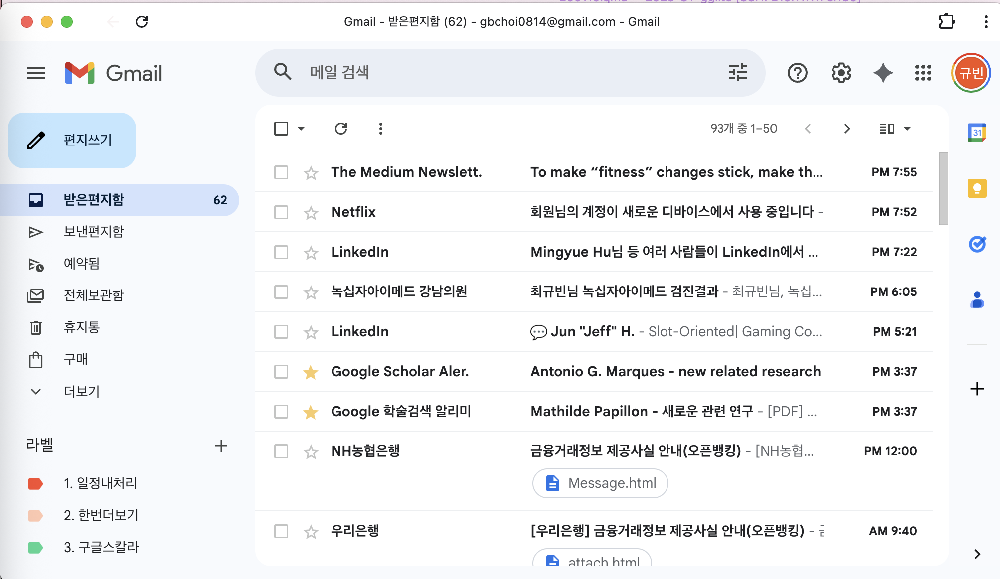
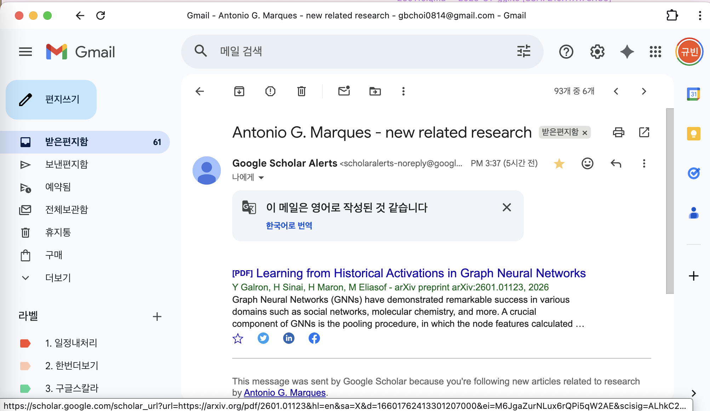

### 목차

1. AI의 어제와 오늘
2. AI 도구 연대기
3. Why Positron?
4. 튜토리얼
5. 활용예시
6. 파이썬이랑
7. 마무리하며 

# AI의 어제와 오늘

---

### 인공지능



::: aside
80~90년대 가전제품 광고: '인공지능'이라는 단어를 처음 접한 계기 [@cfchannel_ai_8090]
:::

---

### 인공지능

'인공지능'이라는 단어는 **당시 기술로는 설명하기 어렵지만, 인간처럼 똑똑하게 행동하는 무언가**를 지칭하는 그릇


# AI 도구 연대기

---

### 2022.11 - 2022.12

- 2022년 11월
    - ChatGPT 출시 
- 2022년 12월
    - Perplexity 출시: 답변에 인용 출처를 제공 [@towardsai_perplexity] 

---

### 2023.01 - 2023.12

- 2023년 2월
    - Google Bard 발표 [@nytimes_google_bard] $\to$ 시연 오류로 주가 급락 [@seoul_news_20230210; @chosun_google_bard_stock_drop_2023]
- 2023년 3월
    - GPT-4 출시 (멀티모달) [@wikipedia_gpt4]
    - Claude 1.0 출시 [@wikipedia_claude_language_model]
    - Cursor AI 출시 [@bytebytego_cursor_billions] // [살펴보기](https://www.youtube.com/watch?v=CF4Fb9vkrik)
- 2023년 7월
    - DeepSeek 설립 [@wikipedia_deepseek]
    - Claude 2 출시 [@wikipedia_claude_language_model]
- 2023년 12월
    - Google Gemini 1.0 발표 [@cnn_google_gemini_launch_2023]

---

### 2024.01 - 2024.06

- 2024년 2월 
    - OpenAI Sora 데모 공개 [@retrofuturista_sora]
- 2024년 3월
    - Google Gemini 1.5 Pro 발표 [@google_gemini25_thinking_model]
    - Claude 3 (Opus, Sonnet, Haiku) 출시 [@wikipedia_claude_language_model]
- 2024년 5월
    - GPT-4o 출시 (텍스트, 이미지, 비디오) [@wikipedia_gpt4o]
- 2024년 6월
    - Claude 3.5 Sonnet + Artifacts 출시 [@wikipedia_claude_language_model] // [살펴보기1](https://claude.ai/public/artifacts/45d84b3f-3e51-4297-bcfb-277e98679d94), [살펴보기2](https://guebin.github.io/DL2025/posts/14wk-1.html)

---

### 2024.07 - 2024.12

- 2024년 7월
    - SearchGPT (ChatGPT Search) [@wikipedia_chatgpt_search]
- 2024년 9월
    - OpenAI o1 추론 모델 출시 [@wikipedia_openai_o1]
- 2024년 11월 
    - Windsurf 출시 (Cursor AI와 경쟁) [@webwire_windsurf_editor_launch]
    - MCP 출시 (Anthropic이 오픈소스로 공개) [@anthropic_mcp_open_source] // [살펴보기](https://www.youtube.com/shorts/XPACEy2JlOk)
    
---

### 2025.01 - 2025.07

- 2025년 1월 
    - DeepSeek-R1 출시 -- Nvidia 주가 18% 급락 [@fortune_deepseek_sputnik; @guo2025deepseek; @huggingface_deepseek_r1; @bi_deepseek_nvidia_selloff_2025]
- 2025년 2월 
    - NotebookLM 출시 [@wikipedia_notebooklm; @joongang_notebooklm_2025] 
    - Claude 3.7 Sonnet + Claude Code 연구 프리뷰 [@anthropic_claude_code_preview]
    - Vibe Coding 용어 등장 [@wikipedia_vibe_coding]
- 2025년 5월
    - Claude Code 정식 출시 [@anthropic_claude_code_overview] 
- 2025년 7월
    - Google Gemini CLI 출시 [@scienceinsight_gemini_cli_intro]
    - Perplexity Comet 브라우저 출시 [@perplexity_comet_launch] // [살펴보기](https://www.youtube.com/watch?v=o9Cnk2k4zRg&t=821s)

---

### 2025.08 - 2025.12

- 2025년 8월
    - 나노바나나(Nano Banana) 등장 [@google_aistudio_nanobanana_2025]
- 2025년 10월
    - OpenAI Codex 정식 출시(GA) [@openai_codex_ga_2025]
- 2025년 11월
    - 구글 Antigravity(안티그래비티) 출시 [@humai_google_antigravity_2025]
    - Clawdbot(클로드봇) 최초 출시 // [살펴보기](https://www.youtube.com/watch?v=N8TKRXM3a1I)

---

### 2026.01 - 2026.02

- 2026년 1월    
    - Clawdbot: Anthropic의 상표권 압박, 'Clawd' 명칭 사용 중단 요구 [@mashable_clawdbot_rename_2026]
    - Clawdbot: 'Moltbot'을 거쳐 최종적으로 'OpenClaw'로 개명, 오픈소스 정신 강조
- 2026년 2월
    - OpenAI, OpenClaw 개발자 전격 영입 [@techcrunch_openclaw_acquisition_2026]
    - Claude Code Agent Teams(멀티에이전트시대) [@anthropic_agent_teams_2026]

---

### 주요 경쟁 구도

- 모델: ChatGPT vs Claude vs Gemini
- 에이전틱 AI: Codex vs Claude Code vs Gemini CLI
- 통합개발환경: Cursor vs Antigravity (VSCode도 여전히 건재)
- 이미지/영상 생성: 나노바나나, DALL-E, Midjourney, Sora
- 브라우저 제어 에이전트: Perplexity Comet, Atlas, Claude for Chrome
- 기타: NotebookLM (문서$\to$팟캐스트), Gemini for Workspace 

---

### 저의 구독 정보

| 서비스 | 요금제 | 월 요금 |
|--------|--------|---------|
| ChatGPT | Plus $\to$ Pro $\to$ Plus | $20 $\to$ $200 $\to$ $20 |
| Perplexity | Pro | $20 |
| Cursor AI | Pro $\to$ 해지 | $20 $\to$ $0 |
| Claude | Pro $\to$ Max 20x | $20 $\to$ $200 | 
| Gemini + NotebookLM | AI Pro | $20 | 

> 구독 전략: (번거롭더라도) 월 단위 구독이 유리하다고 생각함.

# 튜토리얼

---

### Positron, Claude Code 설치

- Positron: <https://positron.posit.co>
- Claude Code: <https://code.claude.com/docs>

---

### Positron 셋팅: Extensions

- 기본 내장: Quarto, Jupyter, Ruff, Pyright, Shiny 등
- 필수: Claude Code for VS Code, LaTeX Workshop
- 선택: Codex, Material Icon Theme, 마음에 드는 컬러 테마(GitHub Theme 등), ...

---

### Step1: 프로젝트 폴더 만들기

<iframe width="1000" height="563" src="https://www.youtube.com/embed/-602FJ-K544?enablejsapi=1" frameborder="0" allow="accelerometer; autoplay; clipboard-write; encrypted-media; gyroscope; picture-in-picture" allowfullscreen class="yt-video"></iframe>

---

### Step2: R 사용하기

<iframe width="1000" height="563" src="https://www.youtube.com/embed/yrscxigFBAg?enablejsapi=1" frameborder="0" allow="accelerometer; autoplay; clipboard-write; encrypted-media; gyroscope; picture-in-picture" allowfullscreen class="yt-video"></iframe>

---

### Step3: Terminal 사용하기

<iframe width="1000" height="563" src="https://www.youtube.com/embed/LPlOXfeTDPk?enablejsapi=1" frameborder="0" allow="accelerometer; autoplay; clipboard-write; encrypted-media; gyroscope; picture-in-picture" allowfullscreen class="yt-video"></iframe>

---

### Step4: 클로드코드 켜보기

<iframe width="1000" height="563" src="https://www.youtube.com/embed/hjfO6K5F3iQ?enablejsapi=1" frameborder="0" allow="accelerometer; autoplay; clipboard-write; encrypted-media; gyroscope; picture-in-picture" allowfullscreen class="yt-video"></iframe>

---

### Step5: .tex 사용하기

<iframe width="1000" height="563" src="https://www.youtube.com/embed/P-Y6TmrGEHk?enablejsapi=1" frameborder="0" allow="accelerometer; autoplay; clipboard-write; encrypted-media; gyroscope; picture-in-picture" allowfullscreen class="yt-video"></iframe>

---

### Step6: 원격서버접속하기

<iframe width="1000" height="563" src="https://www.youtube.com/embed/FYzm8TdciEI?enablejsapi=1" frameborder="0" allow="accelerometer; autoplay; clipboard-write; encrypted-media; gyroscope; picture-in-picture" allowfullscreen class="yt-video"></iframe>

# Research Workflow

---

### 예제1: 압축 해제

<iframe width="1000" height="563" src="https://www.youtube.com/embed/VI4dC2qP0qg?enablejsapi=1" frameborder="0" allow="accelerometer; autoplay; clipboard-write; encrypted-media; gyroscope; picture-in-picture" allowfullscreen class="yt-video"></iframe>

<https://github.com/miruetoto/cnu-260330/blob/main/Downloads.zip>

---

### 예제2: 파일 정리

<iframe width="1000" height="563" src="https://www.youtube.com/embed/jES1Cpi5gU8?enablejsapi=1" frameborder="0" allow="accelerometer; autoplay; clipboard-write; encrypted-media; gyroscope; picture-in-picture" allowfullscreen class="yt-video"></iframe>

---

### 예제3: 이미지파일 정리

<iframe width="1000" height="563" src="https://www.youtube.com/embed/2g8GjLuPVRY?enablejsapi=1" frameborder="0" allow="accelerometer; autoplay; clipboard-write; encrypted-media; gyroscope; picture-in-picture" allowfullscreen class="yt-video"></iframe>

---

### 예제4: 텍스트파일 정리

<iframe width="1000" height="563" src="https://www.youtube.com/embed/jFf3zH1FC4s?enablejsapi=1" frameborder="0" allow="accelerometer; autoplay; clipboard-write; encrypted-media; gyroscope; picture-in-picture" allowfullscreen class="yt-video"></iframe>

---

### 예제5: 데이터 정리 및 시각화

<iframe width="1000" height="563" src="https://www.youtube.com/embed/7UIq0tIRQ_M?enablejsapi=1" frameborder="0" allow="accelerometer; autoplay; clipboard-write; encrypted-media; gyroscope; picture-in-picture" allowfullscreen class="yt-video"></iframe>

---

### 예제6: 간단한 이미지 처리

<iframe width="1000" height="563" src="https://www.youtube.com/embed/_5vokyBNQY4?enablejsapi=1" frameborder="0" allow="accelerometer; autoplay; clipboard-write; encrypted-media; gyroscope; picture-in-picture" allowfullscreen class="yt-video"></iframe>

---

### 예제7: Shiny

<iframe width="1000" height="563" src="https://www.youtube.com/embed/vWkbSP2tE2U?enablejsapi=1" frameborder="0" allow="accelerometer; autoplay; clipboard-write; encrypted-media; gyroscope; picture-in-picture" allowfullscreen class="yt-video"></iframe>

---


### 예제8-1: [연구시작하기](https://github.com/miruetoto/cnu-260330/blob/main/%EB%B0%95%EB%AF%BC%EC%88%98%EA%B5%90%EC%88%98%EB%8B%98%ED%95%99%EC%9C%84%EB%85%BC%EB%AC%B8.pdf)

<iframe width="1000" height="563" src="https://www.youtube.com/embed/Nbq4Q_Mw2QI?enablejsapi=1" frameborder="0" allow="accelerometer; autoplay; clipboard-write; encrypted-media; gyroscope; picture-in-picture" allowfullscreen class="yt-video"></iframe>

---

### 예제8-2: 실험하기 + 디버깅

<iframe width="1000" height="563" src="https://www.youtube.com/embed/g4mSMP1x3Dw?enablejsapi=1" frameborder="0" allow="accelerometer; autoplay; clipboard-write; encrypted-media; gyroscope; picture-in-picture" allowfullscreen class="yt-video"></iframe>

---

### 예제8-3: tex

<iframe width="1000" height="563" src="https://www.youtube.com/embed/5nwuWbeH5e8?enablejsapi=1" frameborder="0" allow="accelerometer; autoplay; clipboard-write; encrypted-media; gyroscope; picture-in-picture" allowfullscreen class="yt-video"></iframe>

---

### 예제8-4: TikZ

<iframe width="1000" height="563" src="https://www.youtube.com/embed/yXgllQHF_fA?enablejsapi=1" frameborder="0" allow="accelerometer; autoplay; clipboard-write; encrypted-media; gyroscope; picture-in-picture" allowfullscreen class="yt-video"></iframe>

---

### 예제8-5: Revision

<iframe width="1000" height="563" src="https://www.youtube.com/embed/q2SO55WlTOM?enablejsapi=1" frameborder="0" allow="accelerometer; autoplay; clipboard-write; encrypted-media; gyroscope; picture-in-picture" allowfullscreen class="yt-video"></iframe>

---


### 기타 응용예제1: 프로젝트 페이지 & 패키지 배포

- 프로젝트 페이지
    - <https://guebin.github.io/cascam-results/>
    - <https://guebin.github.io/non-euclidean-models-for-fraud-detection/>
- 패키지 배포
    - <https://github.com/guebin/cascam>

---

### 기타 응용예제2: 관심있는 논문정리 

::: {.panel-tabset}

#### 이메일1
{height="400px"}

#### 이메일2
{height="400px"}

#### 동영상

<iframe width="1000" height="563" src="https://www.youtube.com/embed/nRilgApSW4w?enablejsapi=1" frameborder="0" allow="accelerometer; autoplay; clipboard-write; encrypted-media; gyroscope; picture-in-picture" allowfullscreen class="yt-video"></iframe>

:::

# With 파이썬

---

### 파이썬에서 활용

<iframe width="1000" height="563" src="https://www.youtube.com/embed/qJwNWAgb6u8?enablejsapi=1" frameborder="0" allow="accelerometer; autoplay; clipboard-write; encrypted-media; gyroscope; picture-in-picture" allowfullscreen class="yt-video"></iframe>

<https://youtu.be/mpk4Q5feWaw?si=UsiJ9atsFDjSfW1B>

---

### 사실 Positron을 추천하는 이유가 파이썬때문

`-` 파이썬을 사용하기에 좋은 IDE는? VSCode

<div style="font-size: 0.75em;">

|                      | Jupyter  | VSCode | Spyder   | PyCharm     | Colab       |
|----------------------|----------|-------------|----------|-------------|-------------|
| 에이전틱 AI          | 불편     | 매우 편리   | 불편     | 보통        | 매우 편리   |
| 서버사용             | 매우 편리 | 매우 편리  | 불편     | 보통        | 제한적      |
| R+Python 혼용        | 매우 편리 | 편리        | 불편     | 불편        | 제한적      |
| LaTeX (컴파일)       | 불편     | 매우 편리   | 불편     | 보통        | 거의 불가능 |
| uv 지원              | 보통     | 매우 편리   | 불편     | 매우 편리   | 불가능      |
| conda 지원           | 매우 편리 | 편리        | 편리     | 편리        | 불가능      |
| `.py` 작업 (데이터분석)   | 불편     | 편리  | 매우 편리 | 편리   | 불편        |
| `.py` 작업 (개발)         | 매우 불편 | 매우 편리   | 매우 불편 | 매우 편리 |  불편   |
| `.ipynb` 작업        | 매우 편리 | 편리        | 불편     | 편리        | 매우 편리   |

</div>

---

### 사실 Positron을 추천하는 이유가 파이썬때문

`-` VSCode Forks 중 최고는? 

<div style="font-size: 0.75em;">

|                      | VSCode        | Cursor        | Positron      | Antigravity   |
|----------------------|---------------|---------------|---------------|---------------|
| 에이전틱 AI          | 매우 편리     | 매우 편리  | 매우 편리          | 매우 편리  |
| 서버사용             | 매우 편리  | 매우 편리     | 매우 편리          | 매우 편리          |
| R+Python 혼용        | 편리          | 편리          | **매우 편리**  | 편리          |
| LaTeX (컴파일)       | 매우 편리  | 매우 편리     | 매우 편리          | 매우 편리          |
| uv 지원              | 매우 편리  | 매우 편리     | 매우 편리          | 매우 편리          |
| conda 지원           | 편리          | 편리          | 매우 편리(?)  | 편리          |
| `.py` 작업 (데이터분석)            | 편리  | 편리 | **매우 편리**  ⭐⭐⭐         |  편리     |
| `.py` 작업 (개발)            | 매우 편리  | 매우 편리 | 매우 편리          | 매우 편리     |
| `.ipynb` 작업          | 편리          | 편리          | 편리  | 편리          |
</div>


# 마무리하며

---

### 바이브코딩과 에이전틱AI

`-` 사건: 제 연구실에 있던 정수기에서 물이 샜습니다. 

::: {.panel-tabset}

#### 대화1
{height="1000px"}

#### 대화2
{height="1000px"}

#### 대화3
{height="1000px"}

#### 대화4
{height="1000px"}

:::

---

### Reference

```{=html}
<script>
// YouTube iframe API 로드
var tag = document.createElement('script');
tag.src = "https://www.youtube.com/iframe_api";
var firstScriptTag = document.getElementsByTagName('script')[0];
firstScriptTag.parentNode.insertBefore(tag, firstScriptTag);

var players = {};
var activePlayer = null;
var playersReady = false;

// YouTube API 준비 완료 시 호출되는 함수
function onYouTubeIframeAPIReady() {
  const iframes = document.querySelectorAll('iframe.yt-video');

  iframes.forEach((iframe, index) => {
    const videoId = 'yt-player-' + index;
    iframe.id = videoId;

    players[videoId] = new YT.Player(videoId, {
      events: {
        'onReady': function(event) {
          // 2배속 설정
          event.target.setPlaybackRate(2.0);
        }
      }
    });

    // 클릭 이벤트 추가
    iframe.addEventListener('click', function(e) {
      if (activePlayer && activePlayer !== videoId) {
        document.getElementById(activePlayer).classList.remove('video-active');
      }
      iframe.classList.add('video-active');
      activePlayer = videoId;
      e.stopPropagation();
    });
  });

  playersReady = true;
}

// 키보드 이벤트 처리
document.addEventListener('DOMContentLoaded', function() {
  // HTML5 video 태그 처리
  const videos = document.querySelectorAll('video');
  let activeVideo = null;

  videos.forEach(video => {
    video.playbackRate = 2.0;

    video.addEventListener('click', function(e) {
      if (activeVideo && activeVideo !== this) {
        activeVideo.classList.remove('video-active');
      }
      this.classList.add('video-active');
      activeVideo = this;
      e.stopPropagation();
    });
  });

  // 키보드 단축키
  document.addEventListener('keydown', function(e) {
    if (e.key === ' ' || e.keyCode === 32) {
      e.preventDefault();
      e.stopPropagation();
      e.stopImmediatePropagation();

      // YouTube 플레이어가 활성화된 경우
      if (activePlayer && players[activePlayer]) {
        const player = players[activePlayer];
        const state = player.getPlayerState();
        if (state === YT.PlayerState.PLAYING) {
          player.pauseVideo();
        } else {
          player.playVideo();
        }
      }
      // HTML5 video가 활성화된 경우
      else if (activeVideo) {
        if (activeVideo.paused) {
          activeVideo.play();
        } else {
          activeVideo.pause();
        }
      }
      return false;
    }

    // 활성화된 플레이어나 비디오가 없으면 무시
    if (!activePlayer && !activeVideo) return;

    let handled = false;

    switch(e.key) {
      case '1':
        // 1: 2초 뒤로
        if (activePlayer && players[activePlayer]) {
          const player = players[activePlayer];
          const currentTime = player.getCurrentTime();
          player.seekTo(Math.max(0, currentTime - 2), true);
          handled = true;
        } else if (activeVideo) {
          activeVideo.currentTime = Math.max(0, activeVideo.currentTime - 2);
          handled = true;
        }
        break;
      case '3':
        // 3: 2초 앞으로
        if (activePlayer && players[activePlayer]) {
          const player = players[activePlayer];
          const currentTime = player.getCurrentTime();
          const duration = player.getDuration();
          player.seekTo(Math.min(duration, currentTime + 2), true);
          handled = true;
        } else if (activeVideo) {
          activeVideo.currentTime = Math.min(activeVideo.duration, activeVideo.currentTime + 2);
          handled = true;
        }
        break;
      case '2':
        // 2: 재생/일시정지
        if (activePlayer && players[activePlayer]) {
          const player = players[activePlayer];
          const state = player.getPlayerState();
          if (state === YT.PlayerState.PLAYING) {
            player.pauseVideo();
          } else {
            player.playVideo();
          }
          handled = true;
        } else if (activeVideo) {
          if (activeVideo.paused) {
            activeVideo.play();
          } else {
            activeVideo.pause();
          }
          handled = true;
        }
        break;
      case 'ArrowUp':
      case 'ArrowDown':
      case 'ArrowLeft':
      case 'ArrowRight':
      case 'PageUp':
      case 'PageDown':
        // 비디오 활성화시 페이지 스크롤 키 차단
        e.preventDefault();
        e.stopPropagation();
        e.stopImmediatePropagation();
        return false;
    }

    if (handled) {
      e.preventDefault();
      e.stopPropagation();
      e.stopImmediatePropagation();
      return false;
    }
  }, true);

  // 문서 클릭시 비활성화
  document.addEventListener('click', function(e) {
    if (activeVideo && !e.target.closest('video')) {
      activeVideo.classList.remove('video-active');
      activeVideo = null;
    }
    if (activePlayer && !e.target.closest('iframe.yt-video')) {
      document.getElementById(activePlayer).classList.remove('video-active');
      activePlayer = null;
    }
  });
});
</script>
<style>
video.video-active,
iframe.video-active {
  outline: 3px solid #4A90E2;
  outline-offset: 2px;
  box-shadow: 0 0 10px rgba(74, 144, 226, 0.5);
}
</style>
```
